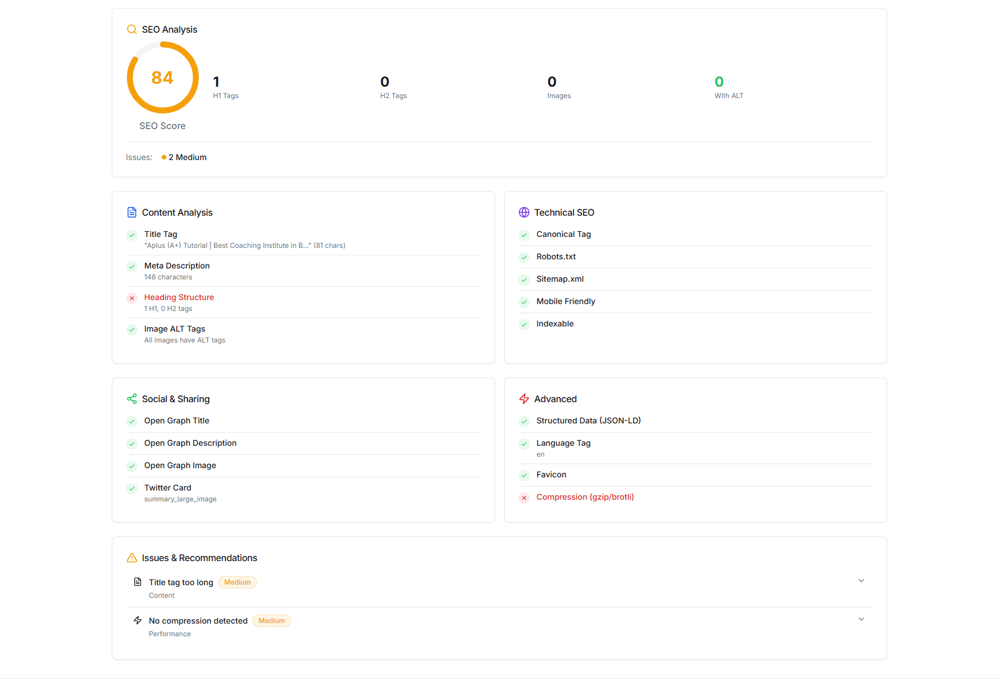
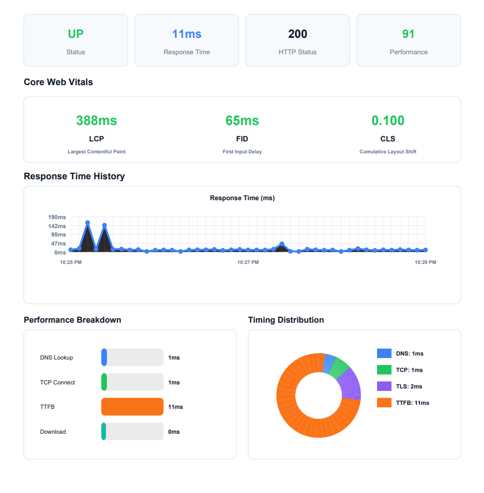
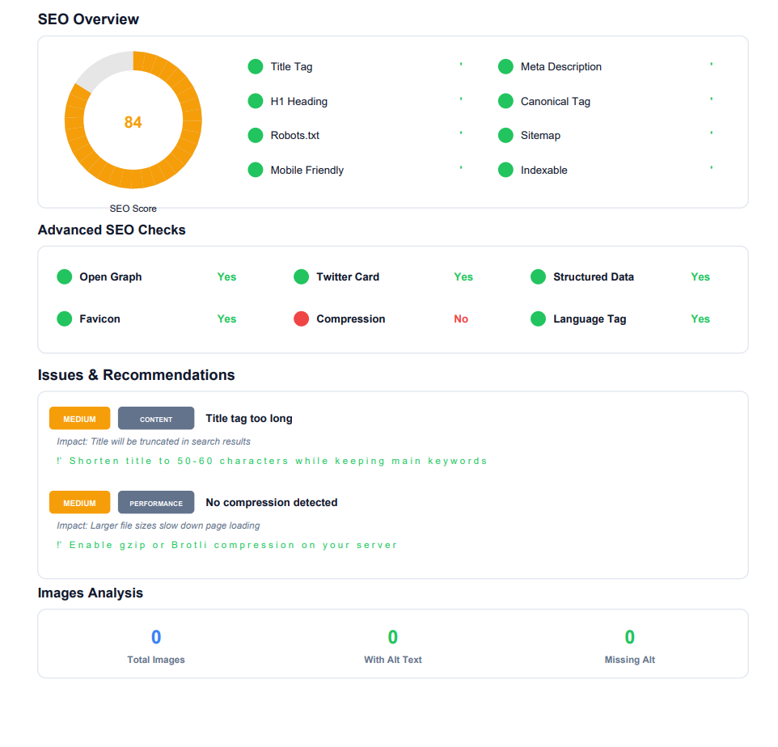

# 📊 WebMetricsX
### Real-Time Website Monitoring & SEO Analytics Platform

WebMetrics is a **production-ready, enterprise-grade web application** that provides **REAL-TIME website monitoring and SEO analytics** using **live APIs, real network requests, and continuous polling**.

The platform delivers **accurate, continuously updating insights every 5 seconds** without requiring any authentication.

---

## 🚀 Key Highlights

- ⚡ Real-time monitoring (updates every 5 seconds)
- 🌐 Live uptime & website health tracking
- 📈 Advanced performance analytics
- 🔍 Professional SEO audits with actionable suggestions
- 📊 Colorful charts, graphs & histograms
- 📄 Export full dashboard as professional PDF
- 📱 Fully Android & mobile friendly UI
- ❌ No login / signup / OAuth
- ❌ No mock data, fake data, or placeholders

---

## 🧠 How WebMetrics Works (High-Level Flow)

```
┌────────────┐
│   User     │
│ Pastes URL │
└─────┬──────┘
      │
      ▼
┌────────────────────┐
│ Auto URL Detection │
└─────┬──────────────┘
      │
      ▼
┌──────────────────────────────┐
│ Real-Time Monitoring Engine  │
│ (HTTP, DNS, TLS, SEO, CWV)   │
└─────┬────────────────────────┘
      │
      ▼
┌──────────────────────────────┐
│ Live Dashboard (5s Updates)  │
│ Charts • Metrics • Alerts   │
└─────┬────────────────────────┘
      │
      ▼
┌──────────────────────────────┐
│ Export Analytics as PDF      │
└──────────────────────────────┘
```

---

## 🏗️ System Architecture (ASCII Diagram)

```
┌───────────────────────┐
│       Frontend        │
│  React / UI Layer    │
│  Charts & Dashboard  │
└───────────┬──────────┘
            │
            ▼
┌──────────────────────────────┐
│        Backend (Cloud)       │
│  Real HTTP Probing Engine    │
│  Performance Collectors     │
│  SEO & Lighthouse APIs      │
└───────────┬─────────────────┘
            │
            ▼
┌──────────────────────────────┐
│ External Real APIs & Targets │
│ Websites • DNS • SSL • SEO  │
└──────────────────────────────┘
```

---

## 🔍 Real-Time Monitoring Features (20+)

1. Website status (Up / Down / Degraded)
2. HTTP response status codes
3. Current response time (ms)
4. Average response time
5. Time To First Byte (TTFB)
6. DNS lookup time
7. TCP connect time
8. TLS handshake time
9. SSL certificate validity & expiry
10. Page load performance score
11. 24-hour uptime percentage
12. Response time history timeline
13. Error rate detection
14. Latency spike detection
15. Performance breakdown (DNS / Connect / TTFB / Download)
16. Core Web Vitals (LCP, FID, CLS)
17. Mobile performance score
18. Desktop performance score
19. Accessibility score
20. Best Practices score
21. Last checked timestamp

---

## 📊 Data Visualization

WebMetrics uses **REAL collected data only** to render:

- Line charts (response time over time)
- Bar charts (performance metrics)
- Area charts (uptime trends)
- Histograms (latency distribution)
- Status badges & indicators

**Chart Rules:**
- Flat colors only
- No gradients
- Professional, subtle animations
- Tooltips & legends enabled

---

## 🔎 SEO Analytics Module

WebMetrics performs **real SEO analysis** using live APIs and crawls:

- SEO score (0–100 via Lighthouse)
- Title tag presence & length
- Meta description validation
- H1 / H2 structure checks
- Image ALT tag detection
- Canonical tag availability
- Robots.txt & sitemap.xml checks
- Mobile friendliness
- Indexing readiness

### Output:
- SEO score
- Missing elements
- Clear improvement suggestions
- Actionable recommendations

---

## 📄 PDF Export

- Export the **entire dashboard** as a professional PDF
- Same layout, same charts, same colors
- Real collected data only
- Includes:
  - Website URL
  - Timestamp
  - All analytics sections

---

## 🎨 UI / Design Philosophy

- Enterprise-grade UI (GitHub / Vercel / Grafana inspired)
- Flat, minimal design
- Neutral base colors (white, black, gray)
- Subtle accent colors for charts
- Card-based layout
- Clean typography & spacing

---

## 📱 Android & Mobile Support

- Fully responsive design
- Touch-friendly charts
- Optimized for Android browsers
- Smooth performance on low-end devices
- No horizontal scrolling

---

## 🌐 SEO-Friendly Application Structure

- Semantic HTML
- Proper meta tags
- Clean DOM structure
- Optimized rendering
- Target Lighthouse score: **100**

---
### Dashboard


### Performance:

### SEO:

### Exported_PDF:

### Exported_PDF


---

## 🛠️ Tech Stack

### Frontend
- React.js (component-based UI)
- Tailwind CSS / CSS Modules (flat, enterprise UI)
- Chart.js / Recharts (charts & graphs)
- Axios / Fetch API
- Responsive layout (mobile-first)

### Backend
- Node.js
- Express.js
- Lovable Cloud backend execution
- Real HTTP probing engine
- Polling / background jobs (5s interval)

### APIs & Monitoring
- Lighthouse API
- Google PageSpeed Insights API
- Real HTTP & DNS probing
- SSL certificate inspection
- Core Web Vitals collection

### Utilities
- PDF generation (dashboard export)
- WebSockets / polling
- Error handling & retries

---

## 🔧 Setup Instructions

### Prerequisites
- Node.js (v18+ recommended)
- npm or yarn
- Internet access (for real APIs)
- Lovable Cloud enabled

---

### Local Setup

```bash
# Clone the repository
git clone https://github.com/your-username/webmetrics.git

# Move into project directory
cd webmetrics

# Install dependencies
npm install

# Start development server
npm run dev
```

## ❗ Strict Rules (Non-Negotiable)

❌ No mock data  
❌ No fake analytics  
❌ No static demo values  
❌ No randomly generated numbers  
❌ No authentication system  

---

## 🎯 Final Goal

Deliver a **REAL, WORKING, PRODUCTION-READY**  
**WebMetrics platform** that provides:

- Live website monitoring  
- Real-time analytics every 5 seconds  
- Professional SEO insights  
- Enterprise-grade dashboard experience  

---

> **WebMetrics — Measure the Web. In Real Time.**
