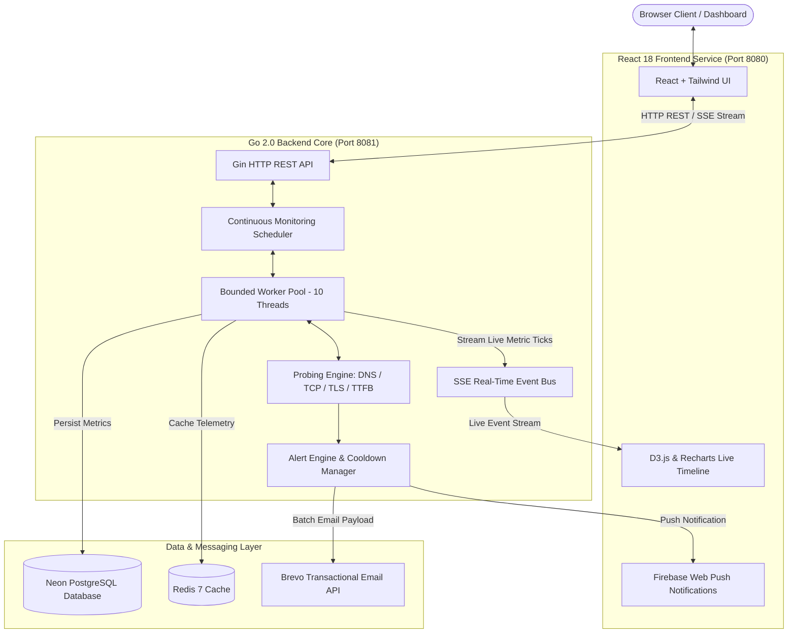
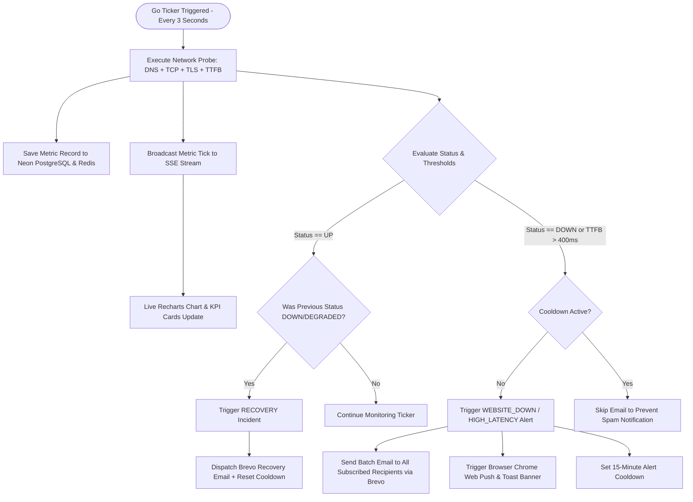

# WebMetricsX 2.0
### Real-Time Website Monitoring, Reliability & SEO Performance Analytics Platform

WebMetricsX 2.0 is a **production-ready, enterprise-grade website reliability platform** powered by a high-concurrency **Go 2.0 backend core**, **3-second high-frequency worker probing**, **Server-Sent Events (SSE) live chart telemetry**, and **instant Brevo transactional email & Web Push downtime alerting**.

The platform delivers real-time website status tracking, deep HTTP timing metrics (DNS, TCP, TLS, TTFB), SSL certificate verification, and Core Web Vitals analytics without requiring login or third-party tracking.

---

## ⚡ Key Highlights (V2.0 Core Features)

- 🚀 **Go 2.0 High-Concurrency Probing Engine**: Multithreaded Go worker pool executing background network probes.
- ⚡ **3-Second High-Frequency Tickers**: Real-time HTTP, DNS, TCP, and TLS phase measurement every 3 seconds.
- ✉️ **Brevo Transactional Email Alerts**: Instant HTML email notifications delivered to all subscribed recipients via Brevo API batching.
- 🔔 **Chrome & Browser Web Push Alerts**: Firebase Cloud Messaging (FCM) background desktop notifications for instant downtime visibility.
- 📡 **Server-Sent Events (SSE) Telemetry Stream**: Live event bus (`/api/v1/monitoring/stream`) broadcasting real-time metrics for dynamic D3.js & Recharts visualizations.
- 💾 **Neon PostgreSQL & Redis Infrastructure**: Persistent target state, worker job synchronization, and anomaly cooldown management.
- 📊 **Core Web Vitals & SEO Audits**: Real-time LCP, FID, CLS, and full HTML markup validation via Google PageSpeed Insights API.
- 📄 **Client-Ready PDF Reports**: One-click professional dashboard export for client reporting.
- 🐳 **Docker & Docker Compose Ready**: Multi-stage containerized deployment for local development and cloud production.

---

## 🏗️ System Architecture Flow


```mermaid
graph TD
    USER([Browser Client / Dashboard])

    subgraph FRONTEND ["React 18 Frontend Service (Port 8080)"]
        UI[React + Tailwind UI]
        CHARTS[D3.js & Recharts Live Timeline]
        PUSH[Firebase Web Push Notifications]
    end

    subgraph BACKEND ["Go 2.0 Backend Core (Port 8081)"]
        API[Gin HTTP REST API]
        SCHEDULER[Continuous Monitoring Scheduler]
        WORKERS[Bounded Worker Pool - 10 Threads]
        ENGINE[Probing Engine: DNS / TCP / TLS / TTFB]
        ALERT_ENGINE[Alert Engine & Cooldown Manager]
        SSE_BUS[SSE Real-Time Event Bus]
    end

    subgraph INFRA ["Data & Messaging Layer"]
        POSTGRES[(Neon PostgreSQL Database)]
        REDIS[(Redis 7 Cache)]
        BREVO[Brevo Transactional Email API]
    end

    USER <--> UI
    UI <-->|HTTP REST / SSE Stream| API
    API <--> SCHEDULER
    SCHEDULER <--> WORKERS
    WORKERS <--> ENGINE
    WORKERS -->|Persist Metrics| POSTGRES
    WORKERS -->|Cache Telemetry| REDIS
    ENGINE --> ALERT_ENGINE
    ALERT_ENGINE -->|Batch Email Payload| BREVO
    ALERT_ENGINE -->|Push Notification| PUSH
    WORKERS -->|Stream Live Metric Ticks| SSE_BUS
    SSE_BUS -->|Live Event Stream| CHARTS
```

---

## 🔁 Real-Time Probing & Alerting Lifecycle


```mermaid
graph TD
    START([Go Ticker Triggered - Every 3 Seconds])

    START --> PROBE[Execute Network Probe: DNS + TCP + TLS + TTFB]

    PROBE --> PERSIST[Save Metric Record to Neon PostgreSQL & Redis]

    PROBE --> STREAM[Broadcast Metric Tick to SSE Stream]

    STREAM --> UI_UPDATE[Live Recharts Chart & KPI Cards Update]

    PROBE --> EVALUATE{Evaluate Status & Thresholds}

    EVALUATE -->|Status == UP| RESOLVE_CHECK{Was Previous Status DOWN/DEGRADED?}

    RESOLVE_CHECK -->|Yes| RECOVERY[Trigger RECOVERY Incident]
    RECOVERY --> DISPATCH_RECOVERY[Dispatch Brevo Recovery Email + Reset Cooldown]

    RESOLVE_CHECK -->|No| CONTINUE[Continue Monitoring Ticker]

    EVALUATE -->|Status == DOWN or TTFB > 400ms| ALERT_CHECK{Cooldown Active?}

    ALERT_CHECK -->|No| TRIGGER[Trigger WEBSITE_DOWN / HIGH_LATENCY Alert]

    TRIGGER --> EMAIL_BATCH[Send Batch Email to All Subscribed Recipients via Brevo]
    TRIGGER --> PUSH_ALERT[Trigger Browser Chrome Web Push & Toast Banner]
    TRIGGER --> SET_COOLDOWN[Set 15-Minute Alert Cooldown]

    ALERT_CHECK -->|Yes| SKIP[Skip Email to Prevent Spam Notification]
```

---

## 🛠️ Technology Stack

### Frontend Service
- **Core**: React 18, TypeScript, Vite
- **Styling**: Tailwind CSS, Shadcn UI, Framer Motion
- **Data Visualization**: Recharts, D3.js, Lucide Icons
- **Real-Time Data**: Server-Sent Events (`EventSource`), TanStack Query
- **Notifications**: Firebase Cloud Messaging (FCM), Sonner Toasts

### Go Backend Core
- **Language**: Go 1.24 (High-concurrency goroutines & channels)
- **Web Framework**: Gin Gonic (`gin-contrib/cors`, structured logging)
- **Database & Cache**: Neon PostgreSQL (`lib/pq`, `pgx`), Redis 7 (`go-redis/v9`)
- **Probing Engine**: SSRF-protected HTTP, net.Resolver DNS, net.Dialer TCP, crypto/tls Handshake

### Email & Alerting Engine
- **Transactional Email**: Brevo REST API v3 (Multi-recipient JSON batching)
- **Push Notifications**: Firebase FCM Web Push (`firebase-messaging-sw.js`)

---

## 🐳 Docker & Docker Compose Setup

### Prerequisites
- [Docker Desktop](https://www.docker.com/products/docker-desktop/) (v24+ with Docker Compose v2.20+)
- Environment file setup (`.env`)

### Local Docker Commands

```bash
# 1. Clone the repository
git clone https://github.com/KrrishSR4/WebMetricsX.git
cd WebMetricsX

# 2. Configure Environment Variables
cp .env.example .env

# 3. Build & Launch Containers
docker compose up --build -d

# 4. Inspect Service Status
docker compose ps

# 5. Stop Containers
docker compose down
```

### Exposed Endpoints
- **Frontend Dashboard**: `http://localhost:8080`
- **Go Backend API**: `http://localhost:8081`
- **Backend Health Check**: `http://localhost:8081/health`
- **SSE Telemetry Stream**: `http://localhost:8081/api/v1/monitoring/stream`
- **Redis Cache**: `localhost:6379`

---

## 🛡️ CI/CD Pipeline & Security Hardening

WebMetricsX incorporates a production-grade GitHub Actions CI/CD and security pipeline:

- **Core CI (`.github/workflows/ci.yml`)**:
  - **Frontend Job**: Node.js 20, `npm ci`, ESLint, production build validation.
  - **Backend Job**: Go 1.24, `gofmt` style validation, `go vet`, race-enabled unit tests (`go test -race`), binary compilation (`go build`).
  - **Docker Job**: Docker Compose configuration validation and Buildx image compilation.
- **CodeQL Security Scanning (`.github/workflows/codeql.yml`)**:
  - Multi-language security matrix analyzing both **Go** and **JavaScript/TypeScript**.
- **Dependabot Review & Auto-Merge (`.github/workflows/dependabot-review-automerge.yml`)**:
  - **Automated Security Review**: Evaluates dependency name, target ecosystem, lockfile status, and SemVer classification.
  - **Safe Auto-Merge**: Auto-approves (`gh pr review --approve`) and enables squash auto-merge (`gh pr merge --auto --squash`) ONLY for `PATCH` and `MINOR` version updates upon passing all required CI checks.

---

## 🚫 Non-Negotiable Core Rules

- No mock data or fake analytics.
- Real HTTP probing, DNS resolution, and SSL inspection only.
- Additive Go backend layer preserving all existing PageSpeed Insights & SEO features.
- Primary production URL (`https://webmetricsx.web.app/`) remains unchanged.

---

> **WebMetricsX 2.0 — Measure the Web. In Real Time.**
